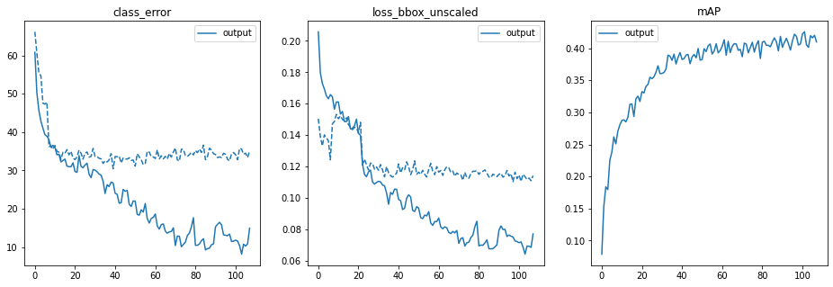
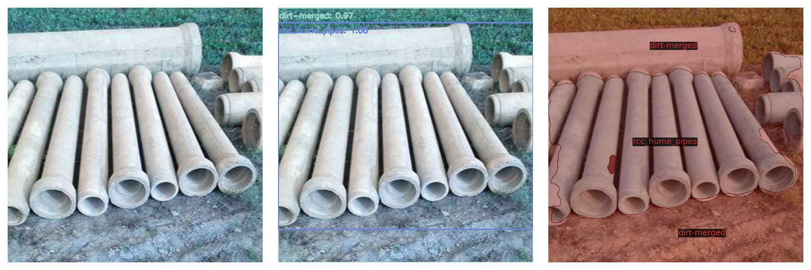

## Table of Content


- [Fine Tuning DeTr: Object Detection and Segmentation](#fine-tuning-detr-object-detection-and-segmentation)
- [Methodology](#methodology)

- [Fine Tuning DeTr: Object Detection and Segmentation](#fine-tuning-detr-object-detection-and-segmentation)
- [Methodology](#methodology)
- [Data Structure](#data-structure)
  - [COCO Format](#coco-format)
- [Object Detection](#object-detection)
  - [Data Prepration](#data-prepration)
  - [Steps For training](#steps-for-training)
- [Results](#results)
  - [Logs](#logs)
  - [Output & Infrence](#output--infrence)
- [Segmentation](#segmentation)
  - [Data Prepration](#data-prepration-1)
  - [Steps For training](#steps-for-training-1)
  - [Predictions](#predictions)


# Fine Tuning DeTr: Object Detection and Segmentation 


Training [DeTr](https://github.com/facebookresearch/detr) on a custom dataset to predict Materials used in Construction Materials.


Unlike traditional computer vision techniques, DETR approaches object detection as a direct set prediction problem. It consists of a set-based global loss, which forces unique predictions via bipartite matching, and a Transformer encoder-decoder architecture. Given a fixed small set of learned object queries, DETR reasons about the relations of the objects and the global image context to directly output the final set of predictions in parallel. Due to this parallel nature, DETR is very fast and efficient.


DETR uses three loss:
- Classification Loss for labels(its weight can be set by loss_ce)
- Bbox Loss (its weight can be set by loss_bbox) as [Gernalized IOU](https://giou.stanford.edu/)
- Loss for Background class


# Methodology


#### Step-1) labeling
I were having a labeled dataset for panoptic segmentation but only things like grader, cement, hydra crane were labeled in the images not stuff classes. So, I used pretrained DeTr on coco dataset for getting annotations for all the classes. 
In this procedure the aim was to get the predicted mask and the bounding box by the pretrained weights for getting the stuff classes. 

NOTE: Everything with is not a construction material like cars, truck, person were treated like stuff for our problem statement.


#### Step-2) Predefined coco classes

I used 1000 images from COCO validation 2017 dataset. All the things classes like person, car truck were labelled miscellaneous stuff. The coco dataset was mixed our dataset didnt have all the stuff classes and I didnt want to miss out on any.

#### Step-3) What about the two separated outputs of DeTr Prediction & Ground Truth?
Finally I had two things: the first is ground truth which was labeled by and prediction of DeTr weights. I mapped both the outputs together for getting labels for all the classes 
Another issue of overlapping coordinates for the classes that were labeled and the same classes predicted by the DeTr, in that case the overlap was removed in predictions and original mask was considered.

#### Step-4) Final step
Finally I had the labeled data so, splitted it in train and test set for training in ration of 80:20, Cloned the Github Repository of DeTr and trained the model on custom classes

# Data Structure 
```
<data>/
    class1/
        images/
            <filename0>.<ext>
            <filename1>.<ext>
            ...
        coco.json
    class2/
        images/
            <filename0>.<ext>
            <filename1>.<ext>
            ...
        coco.json
    ..
```


COCO Format
---------------

COCO is large scale images with Common Objects in Context (COCO) for object detection, segmentation, and captioning data set. COCO has 1.5 million object instances for 80 object categories. COCO stores annotations in a JSON file. Let’s look at the JSON format for storing the annotation details for the bounding box. This will help to create your own data set using the COCO format. You can get the dataset from [their website](https://cocodataset.org/#download)

- info: contains high-level information about the dataset.
- licenses: contains a list of image licenses that apply to images in the dataset.
- categories: contains a list of categories. Categories can belong to a supercategory
- images: contains all the image information in the dataset without bounding box or segmentation information. image ids need to be unique
- annotations: list of every individual object annotation from every image in the dataset

```
"info": [info],
"licenses": [licenses],
"categories": [categories],
"images": [all images],
"annotations": [corresponding annotations]
```

**The Things classes:** *'aac_blocks', ' adhesives', ' ahus', ' aluminium_frames_for_false_ceiling', ' chiller', ' concrete_mixer_machine', ' concrete_pump_(50%)', ' control_panel', ' cu_piping', ' distribution_transformer', ' dump_truck___tipper_truck', ' emulsion_paint', ' enamel_paint', ' fine_aggregate', ' fire_buckets', ' fire_extinguishers', ' glass_wool', ' grader', ' hoist', ' hollow_concrete_blocks', ' hot_mix_plant', ' hydra_crane', ' interlocked_switched_socket', ' junction_box', ' lime', ' marble', ' metal_primer', ' pipe_fittings', ' rcc_hume_pipes', ' refrigerant_gas', ' river_sand', ' rmc_batching_plant', ' rmu_units', ' sanitary_fixtures', ' skid_steer_loader_(bobcat)', ' smoke_detectors', ' split_units', ' structural_steel_-_channel', ' switch_boards_and_switches', ' texture_paint', ' threaded_rod', ' transit_mixer', ' vcb_panel', ' vitrified_tiles', ' vrf_units', ' water_tank', ' wheel_loader', ' wood_primer'*

**The Stuff Classes:** *'banner', 'blanket', 'bridge', 'cardboard', 'counter', 'curtain', 'door-stuff', 'floor-wood', 'flower', 'fruit', 'gravel', 'house', 'light', 'mirror-stuff', 'net', 'pillow', 'platform', 'playingfield', 'railroad', 'river', 'road', 'roof', 'sand', 'sea', 'shelf', 'snow', 'stairs', 'tent', 'towel', 'wall-brick', 'wall-stone', 'wall-tile', 'wall-wood', 'water-other', 'window-blind', 'window-other', 'tree-merged', 'fence-merged', 'ceiling-merged', 'sky-other-merged', 'cabinet-merged', 'table-merged', 'floor-other-merged', 'pavement-merged', 'mountain-merged', 'grass-merged', 'dirt-merged', 'paper-merged', 'food-other-merged', 'building-other-merged', 'rock-merged', 'wall-other-merged', 'rug-merged', 'miscellaneous stuff'*

# Object Detection 

Data Prepration
---------------------------

1. Update annotations of labelled classes using `python autolabellingstuff.py`
2. Change the classes of COCO Valid Set using `python3 transform_coco.py`
3. Create Train Test Split `python train_test_split.py` this script will create train.json and test.json

Steps For training
--------------

```
git clone https://github.com/facebookresearch/detr.git
pip install git+https://github.com/cocodataset/panopticapi.git
pip install -U 'git+https://github.com/cocodataset/cocoapi.git#subdirectory=PythonAPI'
```

Download Pre-Trained Weights
```
cd detr/
mkdir weights
cd weights
wget https://dl.fbaipublicfiles.com/detr/detr-r50-e632da11.pth
cd ..
```
**Start Training :**

1. In `datasets/coco.py` change the paths of *train* and *val*, give path of base directory and train.json and test.json
2. In `models/detr.py` change the number of classes to classes in your dataset
3. In `main.py` change the number of quaries to the maximum objects you want to be detected
4. We need to delete some layers the pre trained model has different number of quaries and classes, at line 179 in main.py add 
    ```
    del checkpoint["model"]["class_embed.weight"]
    del checkpoint["model"]["class_embed.bias"]
    del checkpoint["model"]["query_embed.weight"]
    ```     
5. Replace line 183 `model_without_ddp.load_state_dict(checkpoint['model'], strict=False)`

For the initial 80 epochs model was trained on lower input size of scales `scales = [480, 512, 544, 576, 608, 640]` to speed up the training and later it was traiined on higher resolution `scales = [480, 512, 544, 576, 608, 640, 672, 704, 736, 768, 800]` Training total of 115 epochs, each epoch took around 1.5hr on google colab as only batch size of 2 can be used due to memory limit.
```
python main.py --dataset_file coco --coco_path data/ --output_dir output --resume weights/detr-r50-e632da11.pth --epochs 100 --batch_size 2

When resuming Training 
python main2.py --dataset_file coco --coco_path data/ --output_dir output --resume output/checkpoint.pth --epochs 100 --batch_size 2
```

# Results
Logs
------------
[check results and training logs here](detr/output/log.txt)

```
from pathlib import Path
from util.plot_utils import plot_precision_recall, plot_logs

log_dir = Path('output')
plot_logs(log_dir)
```




Output & Infrence
--------

For inference run `detect.py` by default it takes data from test.json, if you want to run on single image use `infer` function
```
python detect.py --num_test 100 --thresh 0.65 --resume output/checkpoint.pth --save_location predictions_out
```
The 100 saves results can be found in [folder](images/results), few results are displayed below


# Segmentation 

Data Prepration
---------------------------

1. Update annotations according to format for panoptic using [2panoptic_format.py](/2panoptic_format.py) `python 2panoptic_format.py`
2. A custom dataloader was created [custom_panoptic.py](/detr/datasets/custom_panoptic.py)

Steps For training
--------------

Changes Will be required as we created a custom dataloader file named custom_panoptic

1. In `datasets/__init__.py` change line 21 to `if args.dataset_file == 'custom_panoptic':`
2. In `models/detr.py` change line 355 to `if args.dataset_file == "custom_panoptic":`

```
python main2.py --masks --epochs 25 --lr_drop 15 --coco_path data/ --coco_panoptic_path  data/ --dataset_file custom_panoptic  \
  --output_dir output_pan --frozen_weights output/checkpoint.pth
  
while resuming training 
python main2.py --masks --epochs 25 --lr_drop 15 --coco_path data/ --coco_panoptic_path  data/ --dataset_file custom_panoptic  \
  --output_dir output_pan --frozen_weights output/checkpoint.pth --resume output_pan/checkpoint.pth
```

Predictions
-----------
The segmentaion model was trainined for 25 epochs, the 100 results are stored in [folder](images/results_pan), few results are displayed below





